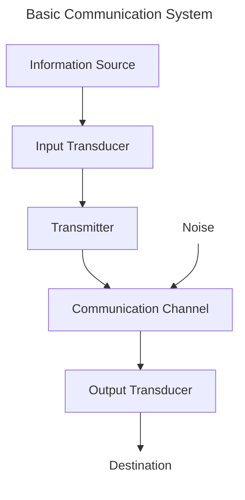
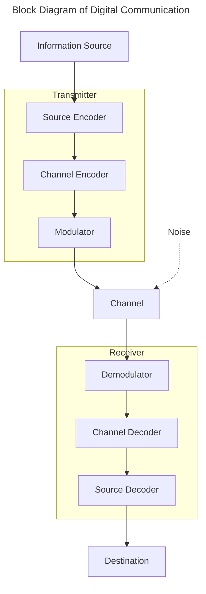
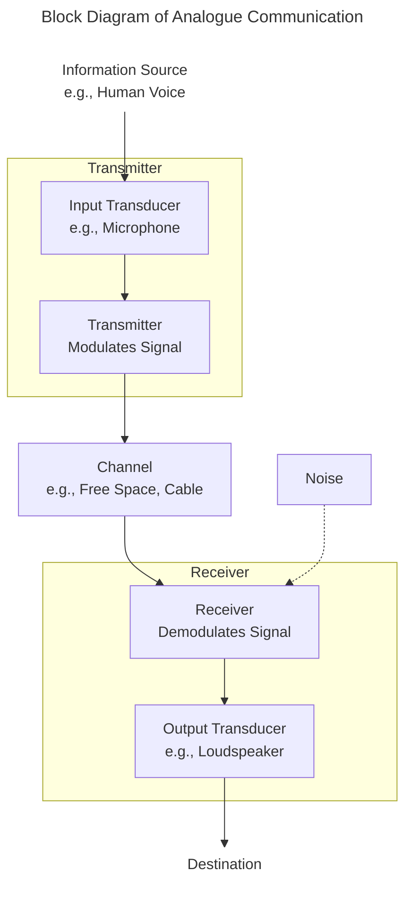
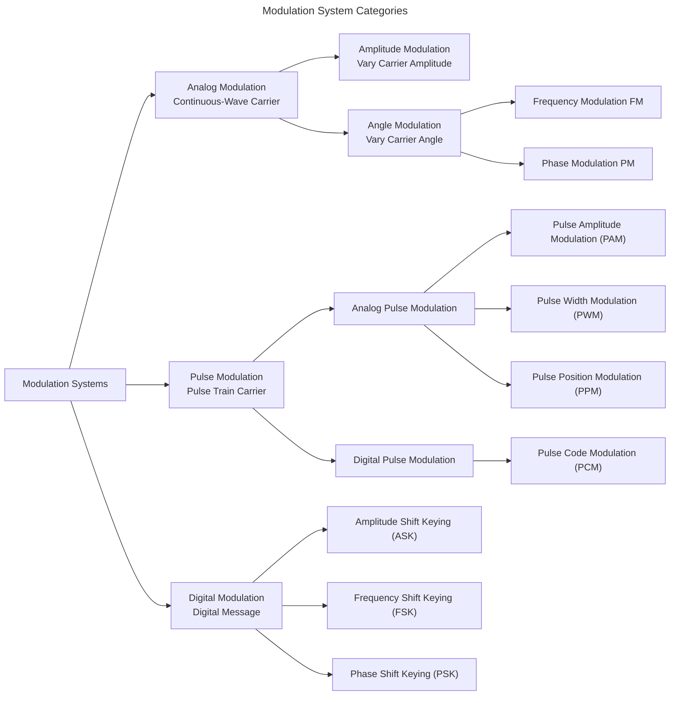

# 1.1 Fundamental Concepts
## A. Introduction to Communication System
- is an engineered assembly designed to transfer information from a source at one point to a destination at another point.
- The information to be conveyed could be any form of data: speech, image, raw facts, or command.
### A.1 Basic Communication System
- All communication systems, whether analogue or digital, share a common fundamental structure.
- The major elements are designed to overcome the challenges of transmitting a signal 
- The block diagram of communication system:

### A.2 Components
1. **Information Source**:
	- This is the origin of the message.
	- Two source:
		- Analogue Source: Produces a message that is continuous in both time and amplitude (e.g., human voice, an analogue thermometer reading, a video camera signal).
		- Digital Source: Produces a message that is discrete in both time and amplitude, represented by a finite set of symbols (e.g., a computer keyboard, a text file, a digital sensor).
2. **Input Transducer**:
	- The message from the source is often not electrical.
	- This block converts the physical message (sound, light, pressure) into an electrical signal suitable for the system to process.
	- e.g., a microphone (transduces sound to a voltage) or a camera sensor (transduces light to voltage).
3. **Transmitter**:
	- This is where the signal is prepared for its journey.
	- The raw message signal is often weak and unstable for direct transmission. The transmitter's primary job is modulation (*alteration of the amplitude or frequency of an electromagnetic wave or other oscillation in accordance with the variations of a second signal.*)
4. **Channel**
	- Physical medium that bridges the gap between transmitter and receiver.
	- The channel is a primary source of degradation, introducing attenuation (signal loss), distortion, and noise.
	- Two categories:
		- Line/Wired Channels: Provide a dedicated point-to-point connection, like Twisted Pair/Coaxial Cable.
		- Space/Wireless Channels: Can be point-to-point or broadcast, like Microwave Links, Satellite links.
5. **Receiver**
	- Located at the destination end.
	- Performs the reverse operation of the transmitter.
	- Its main task is Demodulation (or Detection).
	- Extracts the original message signal from the received, modulated high-frequency carrier.
	- It must also amplifies the weak received signal and filter out unwanted noise.
6. **Output Transducer**
	- Converts the electrical signal back into its original form that the destination can understand.
	- e.g., a loudspeaker (voltage to sound) or a display screen (voltage to light).
7. **Noise**:
	- Unwanted but inevitable electrical disturbance that gets added  to the signal as it traverses the channel.
	- It degrades the quality of the received signal and is the fundamental problem every communication system combat.
## B. Analogue/Digital Communication System
- Classification is according to the nature of the signal being transmitted/received.
- **Analogue CS**:
	- The message and the transmitted signal are both analogue.
	- The transmitter uses analogue modulation techniques like AM/FM, where a continuous carrier wave's parameter (amplitude or frequency) is varied continuously in proportion to the message signal.
- **Digital CS**:
	- The message is converted into a discrete stream of symbols (typically bits, 0s and 1s) before transmission.
	- The digital bit stream is then modulated.
	- This conversion adds complexity but brings significant advantages.
### B.1 Digital CS

#### B.1.1 Components
1. **Source Encoder**
	- Removes redundancy from the source data to improve efficiency.
	- Goal is to represent the source information with the fewest bits possible through compression.
	- e.g., converts PCM audio or compressed image/video into a compact bitstream.
2. **Channel Encoder**
	- Intelligently adds redundancy back into the bitstream.
	- The extra (parity) bits are structured to allow the receiver to detect and correct errors introduced by the noisy channel.
3. **Channel Modulator**
	- Maps the digital bitstream from the channel encoder onto an analogue carrier wave for transmission.
	- Basic techniques include:
		- ASK (Amplitude Shift Keying): Varying the carrier's amplitude.
		- FSK (Frequency Shift Keying): Varying the carrier's frequency.
		- PSK (Phase Shift Keying): Varying the carrier's phase.
4. **Channel Demodulator**
	- Channel demodulator converts electrical signal into sequence of bits.
	- Makes an initial "best guess" of the transmitted bits from the noisy received signal.
5. **Channel Decoder**
	- Uses added redundancy to identify and correct errors in this bitstream, delivering a much more reliable data sequence to the next stage.
6. **Source Decoder**
	- Reverses the source encoding process, decompressing the bitstream to reconstruct the original message signal.
	- e.g., converting bits back to audio samples.
#### B.1.2 Contrasting A/D systems & Duplex Operation
- Working in Duplex Mode:
	- A system that operates in full-duplex mode allows simultaneous two-way communication (e.g., a telephone conversation).
	- A half-duplex system allows two-way communication, but only in one direction at a time.
	- Sketch:
		- A full-duplex system essentially requires two complete systems like the diagrams above.
		- One at each end, connected in opposite directions.
		- They often share a single physical channel through techniques like Time Division Multiplexing (TDM) or Frequency Division Multiplexing.
- Contrast with Analog:
	- The most significant difference is the digital system's ability to regenerate signals.
	- An analogue amplifier amplifies  both the signal and the accumulated noise.
	- A digital regenerator, however, can determine the original bit and create a perfect, noise-free new signal for the next hop.
	- This makes long-distance communication far more reliable.
### B.2 Analogue CS
- The primary goal is to transmit message signal that is continuous in both time and amplitude.
- The system modifies this signal for efficient transmission over a physical channel and reconstructs it at the destination.

#### B.2.1 Components
- **Information Source**:
	- Origin of the message or information to be sent.
	- The source produces a time-varying physical phenomenon that contains information.
	- e.g., a person speaking.
- **Input Transduce**r:
	- To convert the non-electrical message produced by the information source into an electrical analogue signal.
	- This electrical form is necessary for subsequent processing by the electronic communication system.
	- e.g., a microphone.
- **Transmitter**:
	- To modulate the baseband signal and prepare it for transmission over the channel.
	- It also amplifies the signal to a sufficient power level.
	- e.g., modulation via AM/FM.
- **Communication Channel**:
	- Physical medium that acts as a bridge for the modulated signal to travel from the transmitter to the receiver.
	- It includes attenuation, distortion, noise, etc.
	- e.g., Twisted pair copper wire.
- **Receiver**:
	- Located at the destination end, the receiver performs the reverse operation of the transmitter.
	- Used to select, amplify and demodulate the received signal.
- **Output Transduce**r:
	- To convert the demodulated electrical signal back to its original physical form, which is perceivable by the destination (human or device).
	- e.g., loudspeaker.
- **Destination**:
	- Final point where the recovered message is utilised.
	- Intended recipient of the information.
	- e.g., a person listening to a radio.
## C. Comparative Adv
### C.1 Digital over Analogue:
- **Robustness to Noise**: The ability to detect and correct errors, coupled with signal regeneration, makes digital transmission much more immune to noise and interference.
- **Higher Fidelity**: For long-distance communication, digital signals can be regenerated to perfection, whereas analogue signals suffer from cumulative and irreversible noise.
- **Data Security & Encryption**: Digital data can be easily and powerfully encrypted using complex algorithms, ensuring secure communication.
- **Efficient Multiplexing**: TDM for digital signals is simpler and far more efficient than FDM for analogue signals.
- **Flexibility & integration**: Digital signals are compatible with modern digital processing, storage (e.g., CDs, hard drives), and can seamlessly integrate voice, video and data.
### C.2 Analogue over Digital
- **Simplicity & Cost**: Analogue Circuits (especially for simple modulation like AM) are generally less complex and cheaper to implement.
- **Lower Bandwidth Requirement**: A simple analogue modulation like AM requires less bandwidth than its digital counterpart for the same baseband message.
- **No Latency**: Analogue systems process signals in real-time with virtually no delay. Digital systems introduce a small processing delay (latency) due to encoding, decoding, buffering which can be critical in real-time control applications.
- **No Quantisation Error**: Analogue systems are continuous and do not suffer from quantisation noise, which is inherent in the analogue-to-digital conversion process. This can be important for hgih-fidelity audio in a limited, noise-free environment.
# 2. Noise, Distortion and Interference
These three phenomena are primary sources of signal degradation in any communication system, limiting its performance, capacity and reliability.
## A. Noise
- Concept:
	- Noise is any unwanted, random, and non-informational signal that adds itself to the transmitted signal during its journey from source to destination.
	- It is fundamentally unpredictable and degrades the system's performance by obscuring the intended message.
- How it limits performance:
	- Noise sets the ultimate limit on a system's performance.
	- It determines the minimum signal strength required for intelligible reception,
	- it limits the maximum data range in digital systems (as per Shannon's Theorem),
	- and it reduces the overall fidelity and dynamic range of analogue systems.
- Noise is broadly classified based on its origin.
### A.1. Internal Noise
- Generated within the electronic components of the communication system itself.
- It is inescapable but can be minimised by design.
#### # Types:
1. **Thermal** (Johnson-Nyquist) Noise:
	- Concept:
		- Due to the random, thermal agitation of charge carriers (electrons) in any conductor or semiconductor having resistance.
		- This motion increases with temperature.
	- Characteristics:
		- It is white noise,
		- this means that it has a uniform power spectral density across all frequencies.
		- It is the most fundamental and unavoidable form of internal noise.
	- Noise Power: The available thermal noise power is given as: $P_n$ = k T B watts where, 
		- k = Boltzmann's constant (1.38 x 10$^{-23}$ ) Joules/Kelvin.
		- T = temperature of conductor in Kelvin.
		- B = Bandwidth of noise spectrum, Hz.
	- Minimisation:
		- Use low-noise amplifiers, cool critical components, and limit bandwidth to the minimum required.
2. **Shot Noise**:
	- Concept:
		- Due to the discrete particle particle nature of electric current.
		- In devices like transistors and diodes, current is not a continuous flow but a stream of discrete electrons.
		- The random arrival times of these electrons at a junction cause fluctuations in the current.
	- Characteristics:
		- It also white noise and is prominent in active devices.
3. **Partition Noise**:
	- It is the noise generated due to the random fluctuation in division of current into two or more path.
	- This partition noise is more prominent in transistors than in diodes.
4. **Flicker** or Low Frequency Noise:
	- Cause:
		- Arises from imperfections in semiconductor materials and surface states, leading to random fluctuations in carrier density.
		- The causes are not fully understood but are related to defects and traps.
	- Characteristics:
		- Its power spectral density is inversely proportional to frequency (1/f).
		- It is significant at low frequencies (below a few kHz) and is a major concern in DC amplifiers and oscillators.
5. **Transit Time** or High Frequency Noise:
	- Cause:
		- At very high frequencies, the time it takes for charge carriers (electrons/holes) to cross a semiconductor junction (e.g., in a transistor) becomes comparable to the signal's period.
		- Some carriers may diffuse back, causing a noisy output.
	- Characteristics:
		- Its effect becomes significant as the operating frequencies of a device approaches its maximum limit ($f_T$), degrading high-frequency performance.
6. **Generation-recombination** noise:
	- Random process of generation and recombination of free electrons in semiconductor devices dye to random ionisation of impurities produce this type of noise.
7. **White** noise:
	- It is the ideal case of description of noise
### A.2. External Noise:
Generated outside the communication system, originating from the environment or other man-made sources.
#### # Types:
1. **Atmospheric Noise** (Natural):
	- Cause:
		- Primarily caused by lightning discharges during thunderstorms.
		- Each stroke generates a wideband electromagnetic impulse that can propagate over long distances.
	- Effect:
		- In analogue systems like AM radio atmospheric noise manifests as loud "crackles" and "static" that severely degrade the listening experience, especially in the medium and shortwave bands.
	- Characteristics:
		- Its intensity varies with frequency, time of day, and geographical location.
		- It is most severe in the low frequency and medium frequency bands.
2. **Extraterrestrial noise**:
	- Cause:
		- Originates from outer space.
		- Key sources include solar noise (from the sun), cosmic noise (from distant stars and galaxies as background noise of universe).
	- Characteristics:
		- Significant for satellite communication and radio astronomy.
3. **Man-made** (Industrial) noise:
	- Cause:
		- Generated by a vast array of electrical and electronic equipment.
		- Examples include:
			- Ignition systems of automobiles.
			- Switching of high-power circuits.
			- Fluorescent lights.
			- Microwave ovens and switching power supplies.
	- Characteristics:
		- Typically impulsive and concentrated in urban and industrial areas.
## B. Interference
- Concept:
	- Interference is the contamination of the desired signal by another human-made signal operating at or near the same frequency.
	- Unlike noise, interference is a deterministic or predictable phenomenon.
- Sources:
	- **Co-channel interference**:
		- From another transmitter using the exact some frequency channel.
		- e.g., a distant FM station interfering with a local one.
	- **Adjacent-channel Interference**:
		- From a transmitter in a nearby frequency channel.
		- This happens often due to insufficient filtering allowing its signal to "bleed" into the desired channel.
	- **Inter-symbol Interference** (ISI):
		- An internal interference where the pulse representing one symbol smears into the time slots of subsequent symbols in a digital system, primarily due to channel dispersion and limited bandwidth.
## C. Distortion
- Concept:
	- Distortion is any unwanted change in the shape of the output signal waveform compared to the input.
	- It occurs when the communication system (or a component within it) fails to treat parts of the signal equally.
- Effects:
	- Distortion corrupts the signal's integrity.
	- In analogue audio, it makes music sound harsh.
	- In digital systems, it can cause bit errors.
	- In video, it can blur image.
- Figure:
   ![[distortion.png | 500]]
### # Classification of Distortion
1.  **Linear Distortio**n:
	- Concept:
		- Produced by linear devices (like filters and amplifiers) that have a non-ideal frequency or phase response.
	- Types:
		- Amplitude Distortion (Frequency Response Distortion):
			- Different frequency components of the input signal are amplified by different amounts.
			- For example, a system that attenuates bass frequencies would make music sound "tinny".
		- Phase Distortion:
			- Different frequency components undergo different time delays.
			- The human ear is relatively insensitive to phase distortion, but the human eye is very sensitive to it in video signals, where it causes blurring and smearing of edges.
2. **Non-Linear Distortion**:
	- Cause:
		- Produced by non-linear devices.
		- e.g., an amplifier driven into saturation.
		- here, the output is not a perfect linear function of the input.
	- Effect:
		- It generates new frequency components (harmonics and  intermodulation products) that were not present in the original input signal.
		- This is a severe form of distortion.
	- Harmonic Distortion:
		- The non-linearity creates integer multiples (harmonics) of the input frequency.
		- If the input is a pure 1 kHz tone, the output will contain 2 kHz, 3 kHz, etc. components.
	- Measurement:
		- The severity is measured by Total Harmonic Distortion (THD).
		- The distortion for a single harmonic is given by:
	- percentage n$^{th}$ harmonic distortion = $\dfrac{An}{A} \cdot 100\%$, where:
		- An = amplitude of n$^{th}$ harmonic component
		- A = amplitude of fundamental frequency component.
## D. Differences
### D.1 Between Noise and Interference
| Feature | Noise                      | Interference                                                  |
| ------- | -------------------------- | ------------------------------------------------------------- |
| Nature  | Random, non-informational. | Deterministic, is itself a information-bearing signal.        |
| Origin  | Natural/Internal.          | Human-made (except for ISI, which is system-induced).         |
| Example | Hiss on an AM/FM radio.    | Hearing another conversation on a cordless phone (co-channel) |
### D.2 Among all 3
| Feature            | Noise                                                    | Interference                                              | Distortion                                                            |
| ------------------ | -------------------------------------------------------- | --------------------------------------------------------- | --------------------------------------------------------------------- |
| Cause              | Random electron motion, thermal effects, natural sources | Another unwanted signal.                                  | Non-ideal system response (linear or non-linear).                     |
| Key Characteristic | Adds random, unpredictable energy to the signal.         | Adds a structured, predictable signal to the desired one. | Alters the shape/waveform of the original signal.                     |
| Example            | Hiss from a microphone, snow on a TV screen.             | Hearing a taxi dispatch on car's radio station.           | Clipping in a loudspeaker (non-linear), muffled phone audio (linear). |
## E. Minimising the effects
1. For Noise:
	- **Increase Signal Power** (Increase SNR): The most straightforward method.
	- **Limit Bandwidth**: Use filters to restrict the system bandwidth to the minimum necessary for the signal, rejecting out-of-band noise.
	- **Use Modulation Schemes**: FM is more immune to noise than AM. Digital modulation (like PSK, QAM) with error correction coding is even more robust.
	- **Use Low-noise components**: At the receiver's front end (Low-Noise Amplifiers - LNAs).
2. For Interference
	- **Filtering**: Use high-quality bandpass filters to reject adjacent-channel signals.
	- **Frequency Planning**: Regulatory bodies (like the FCC) assign frequencies to avoid co-channel interference.
	- **Spread Spectrum Techniques**: Use techniques like CDMA that make signals resistant to narrowband interference.
	- **Shielding**: Use shielded cables and enclosures to block man-made interference from entering the system.
3. For Distortion
	- **Linear Distortion**: Use equalisers to correct for non-uniform frequency and phase responses.
	- **Non-linear Distortion**: Use high-quality, linear components and operate amplifiers with sufficient headroom to avoid saturation.
# 1.2 Modulation
- Concept:
	- Modulation is the systematic process of using a low-frequency message signal (the information we want to send) to vary one or more properties of a high-frequency carrier wave.
- Modulating Signal:
	- The original information-bearing signal (baseband) signal.
	- It is low frequency and often cannot be transmitted efficiently over long distances.
- Carrier Signal:
	- A high-frequency sinusoidal wave (e.g., 100 MHz for FM radio)
	- whose sole purpose is to "carry" the modulating signal.
- Modulated Signal:
	- The final waveform that results from the modulation process.
	- This is the signal that is actually transmitted over the channel.
## A. Need for modulation
- "Communication over long distance is impossible without modulation. Modulation is a must to mitigate several constraints in transmission."
	- This statement is fundamentally true.
	- Without modulation, practical electronic communication over more than a few kilometres would be infeasible.
	- Modulation is not merely an improvement, it is a necessary solution to overcome critical physical and practical constraints inherent in signal transmission.
1. **Practical antenna size**:
	- **Constraint**:
		- For an antenna to radiate power efficiently, its size must be a significant fraction (typically $\dfrac{1}{4}$ or $\dfrac{1}{2}$) of the signal's wavelength.
		- The wavelength ($\lambda$) is given by $\dfrac{c}{f}$, where c is the speed of light and f is the frequency.
	- **Problem**:
		- An audio signal at 1 kHz has a wavelength of 300,000 meters.
		- A  $\dfrac{\lambda}{4}$ antenna would be an impractical 75 km long.
	- **Solution**:
		- By modulating the 1 kHz audio onto a 100 MHz carrier (wavelength = 3 metres), the required antenna size becomes a manageable 0.75 metres.
		- Modulation enables the use of practical, portable antennas.
	- A size of antenna depends on the frequency of the signal.
2. **Overcoming Signal Attenuation*"
	- **Constraint**:
		- All physical channels (wires, free space) attenuate signals.
		- this means, the signal strength decreases with distance.
		- Low frequency signals are attenuated much more severely than high-frequency signals over the same channel.
	- **Problem**:
		- A baseband audio signal would lose its energy and fade to nothing over a very short distance.
	- **Solution**:
		- Shifting the signal to a high-frequency carrier drastically reduces the rate of attenuation, allowing the signal to travel hundreds or thousands of kilometres.
		- Modulation enables long-range communication.
3. **Enabling Multiplexing**:
	- **Constraint**:
		- A communication channel (like a coaxial cable) is an expensive resource.
		- Transmitting only one signal at a time is highly inefficient.
	- **Problem**:
		- Without a way to separate them, multiple simultaneous baseband signals would interfere and become irrecoverable.
	- **Solution**:
		- Modulation allows each message signal to be translated to a different carrier frequency.
		- This is FDM.
		- A receiver can then tune to a specific carrier frequency to select the desired signal, just like tuning a radio.
		- Modulation enables the efficient, simultaneous use of a shared channel by multiple users.
4. **Improving Noise & Interference Immunity**:
	- **Constraint**:
		- Noise and interference are ever-present and disproportionately affect low-frequency signals.
	- **Problem**:
		- A baseband signal corrupted by noise is often impossible to clean up, as filtering noise from the signal's own frequency band is very difficult.
	- **Solution**:
		- Certain modulation schemes are inherently resistant to noise.
		- For example, FM is much less sensitive to amplitude noise than AM.
		- Furthermore, by moving the signal to a higher frequency band, we can avoid low-frequency noise sources (like 1/f flicker noise and some man-made interference).
		- Modulation provides a tool to design robust communication systems.
## B. Classification

1. Analogue Modulation System:
	- In such system, the modulating as well as carrier signal are continuous in nature.
	- It can be further be divided into:
		1. Amplitude Modulation:
			- Here, the amplitude of carrier wave is varied in accordance to the modulating signal.
		2. Angle Modulation:
			- Here, the angle of carrier is varied in terms of the modulating signal.
			- The angle modulation where frequency is altered is termed as frequency modulation and if phase is varied then the modulation is phase modulation.
2. Digital Modulation System:
	- In such system, the modulating signal is digital in nature whereas the carrier can be digital or analogue. Few digital modulation systems are:
		- Amplitude Shift keying
		- Phase Shift keying
		- Frequency shift keying
## C. Working
- The fundamental principle of modulating a channel is to use the message signal to intentionally vary a key parameter of the carrier wave.
- The carrier is a simple sinusoidal, c(t) = $A_c \cos(2\pi f_c t +\phi_c)$, defined by three basic properties.
- Amplitude : $A_c$, Frequency: $f_c$ and its phase: $\phi_c$.
- Modulation algorithms are designed to make the message control one of these properties.
- This controlled variation impresses the information onto the carrier, creating a new signal whose variations in amplitude, frequency or phase are a direct representation of the original message.
- The receiver is designed to detect these specific variations and reverse the process to recover the information.

[[Chapter 2 Representation of signals and systems in communication]]